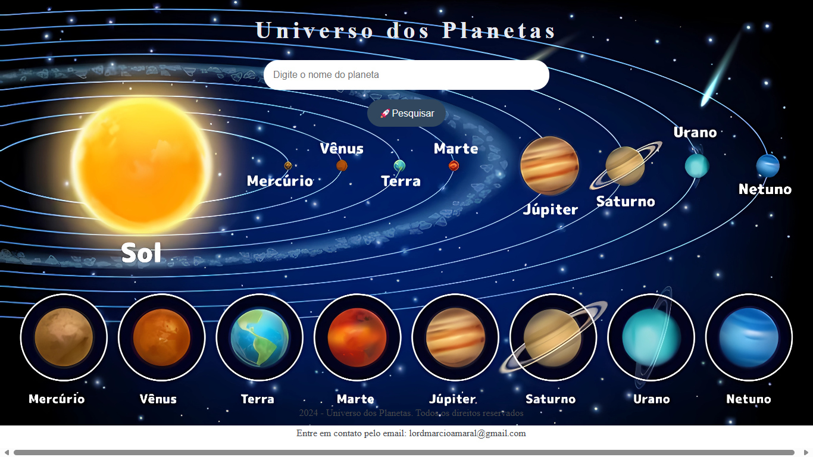

## 🪐 Universo dos Planetas -  Imersão DEV da Alura com Google Gemini - 2024🪐

---

##  Sobre o Projeto

**Explore o Sistema Solar com apenas um clique!** 

Este projeto web te convida a uma jornada pelo cosmos, permitindo que você pesquise por planetas e descubra informações fascinantes sobre cada um deles. 

---

## Funcionalidades:
* **Pesquisa Intuitiva:** Digite o nome de um planeta e descubra detalhes como descrição, imagens e links para mais informações.
* **Interface Amigável:** O design limpo e intuitivo torna a navegação fácil e agradável.
* **Dados Completos:** Uma vasta base de dados com informações detalhadas sobre cada planeta.
* **Responsivo:** Adapta-se perfeitamente a diferentes dispositivos, desde smartphones até desktops.

---

## ️ Tecnologias Utilizadas
*   **HTML:** Estrutura básica da página.
*   **CSS:** Estilização e layout visual.
*   **JavaScript:** Lógica para a pesquisa e exibição dos resultados.

---

## Como Usar

1. **Clone o repositório:** 
   
   git clone https://github.com/MARCIO-MACH4DO/olauniverso

2. **Abra o projeto:** Abra o arquivo index.html em seu navegador.

3. **Pesquise:** Digite o nome de um planeta no campo de pesquisa e clique no botão.

---

## ⭐️ Agradecimentos
Agradeço a todos que contribuíram para este projeto!

Projeto Feito Durante A Imersão DEV Da Alura Com Google Gemini - 2024

---

**Link direto do vercel** https://olauniverso.vercel.app/

**Link direto do GitHub** https://github.com/MARCIO-MACH4DO/olauniverso

